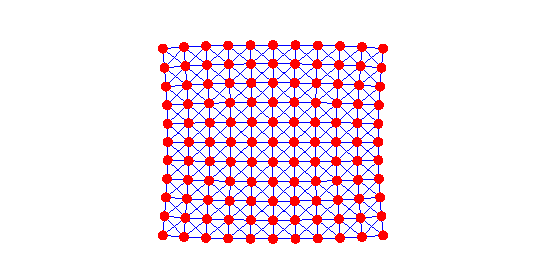
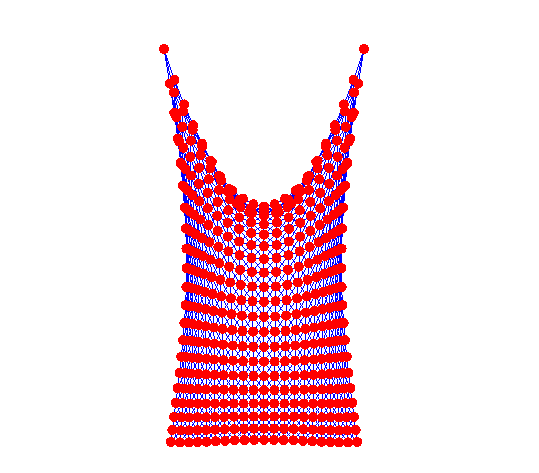
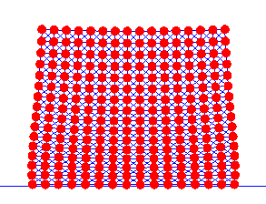
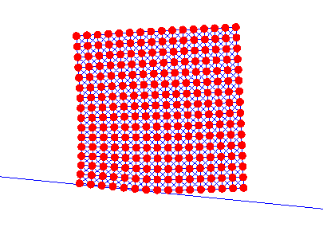
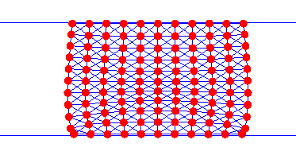
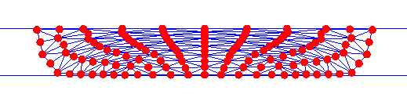
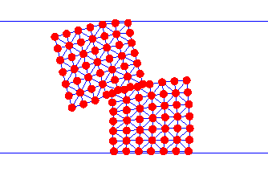
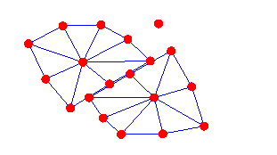

# Muda-based Solid Simulatoion Tutorial
This is a tutorial for the Solid Simulation using Muda (a CUDA programming paradigm https://github.com/MuGdxy/muda).

The basic architecture of the simulators mimics Minchen Li's Solid-Sim-Tutorial(https://github.com/phys-sim-book/solid-sim-tutorial). 

The tutorial (which is also written by a beginner) may provide some help for the beginners to learn how to write simple CUDA codes for implicit solid simulation.
## Usage
1. Clone the repository
```bash
git clone https://github.com/Roushelfy/solid-sim-muda
cd solid-sim-muda
git submodule update --init --recursive
```

2. build with cmake
```bash
mkdir build
cd build
cmake ..
cmake --build .
```

## Requirements
Eigen3==3.4.0

CMake>=3.29

CUDA>=11.0

## Simulators

### 1. Simple Mass-Spring System

### 2. Dirichlet Boundary Condition

### 3. Contact

### 4. Friction

### 5. Moving Dirichlet Boundary

### 6. Neohookean Model

### 7. Neohookean Model with Self Collision

### 8. Neohookean Model with Self  Friction
